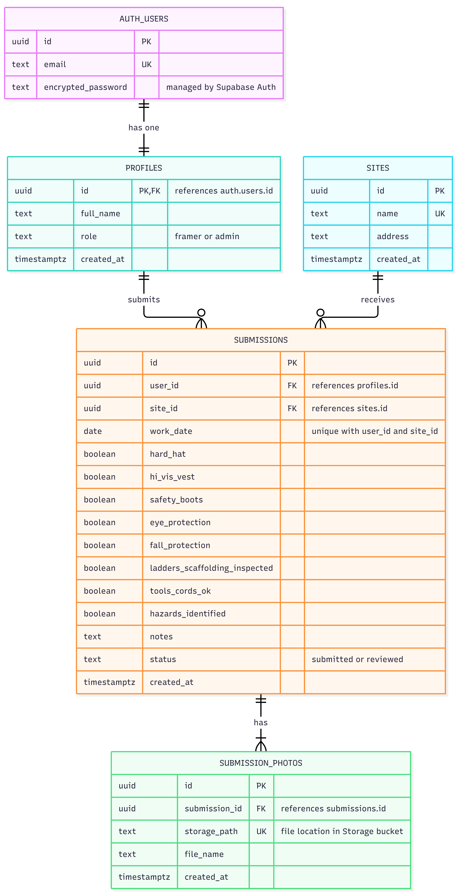

# RAS Site Safety Forms

This is my take-home project for the RAS Junior Software Developer role. Framers fill out a daily safety form (with photos) for the site they're working on, and an admin can see who submitted, where, and when.

**Live app:** https://ron-safety-form-production-ef03.up.railway.app

## Test accounts

All accounts use the password `password`.

- **Admin:** admin@example.com
- **Framers:** lionel.messi@example.com, cristiano.ronaldo@example.com, alphonso.davies@example.com, alex.ferguson@example.com

A framer can only submit one form per site per day. If you get a "you've already submitted" message, try a different site or a different framer.

## What it does

As a **framer**, you log in, pick your site and the date, go through the safety checklist, add a few photos, and submit. You can also look back at your past forms.

As an **admin**, you see who hasn't submitted today, a chart of forms per site for the last week, and a list of every submission that you can filter by site, worker and date. You can open any form to see the checklist, notes and photos, and mark it as reviewed.

The form is built for phones first, since that's where it would actually be used: big tap targets, and the submit button stays at the bottom of the screen.

## How I built it

- **React** (with Vite) for the frontend
- **Node and Express** for the API
- **Supabase** for the Postgres database, logins and photo storage
- **Railway** to host both the API and the frontend

The frontend only talks to Supabase to log in. Everything else goes through my Express API, which checks who you are and what you're allowed to see before touching the database. I did it this way so all the permission rules live in one place. For example, a framer's ID always comes from their login token, never from the form, so nobody can submit a form as someone else or read someone else's forms.

Photos go into a private storage bucket, and the API hands out links that expire after an hour.

## Database



There are four tables: `profiles` (name and role for each login), `sites`, `submissions` and `submission_photos`. Supabase manages the logins themselves in its own `auth.users` table, and each profile shares its ID with a login.

The SQL is in [`supabase/schema.sql`](supabase/schema.sql), and the demo data is in [`supabase/seed.sql`](supabase/seed.sql).

## Running it yourself

You'll need Node 22 or newer and a free Supabase project.

**1. Set up the database**

In the Supabase SQL Editor, run `supabase/schema.sql`. Then create the five test users under Authentication → Users (tick "Auto Confirm User"), and run `supabase/seed.sql`.

The seed data is dated relative to the day you run it, so rerun it if you want "today" to have fresh data.

**2. Start the API**

```bash
cd server
npm install
cp .env.example .env
npm run dev
```

Fill in `.env` with your Supabase URL and secret key. The API runs on http://localhost:3001.

**3. Start the frontend**

```bash
cd client
npm install
cp .env.example .env
npm run dev
```

Fill in `.env` with your Supabase URL, publishable key, and the API's address. The app runs on http://localhost:5173.

## Assumptions I made

- There's no sign-up page. It's an internal tool, so an admin would create accounts.
- Only framers submit forms; admins review them.
- Each framer submits one form per site per day.
- At least one photo is required, up to 5 photos of 5 MB each (JPG, PNG or WebP).
- Framers can leave checklist items unchecked, since they might need to report missing gear. Unchecked items get highlighted for the admin.
- "Hasn't submitted today" means no form at any site that day.
- Dates use the user's own time zone, not the server's. Railway runs on UTC, which is 7 hours ahead of BC, so without this, forms filled out in the evening would land on the next day.
- The logo and RAS green (#045339) come from the RAS website and are only used for this assessment.
- The demo framers are named after soccer players, and the sites are made up.

## If I had more time

- Let admins add sites and users from inside the app
- Shrink photos on the phone before uploading them
- Add automated tests, especially for the permission rules
- Send reminders to workers who haven't submitted by a certain time